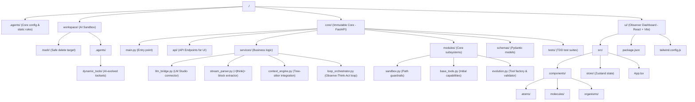

# Codebase Diagram

This diagram represents the Immutable Core directory structure and architecture components.

```mermaid
graph TD
  Root["./"] --> Agents[".agents/ (Core config & static rules)"]
  Root --> Workspace["workspace/ (AI Sandbox)"]
  Workspace --> Trash[".trash/ (Safe delete target)"]
  Workspace --> WorkspaceAgents[".agents/"]
  WorkspaceAgents --> DynamicTools["dynamic_tools/ (AI-evolved toolsets)"]
  Root --> Core["core/ (Immutable Core - FastAPI)"]
  Core --> Main["main.py (Entry point)"]
  Core --> API["api/ (API Endpoints for UI)"]
  Core --> Services["services/ (Business logic)"]
  Services --> LLMBridge["llm_bridge.py (LM Studio connector)"]
  Services --> StreamParser["stream_parser.py (<|think|> block extractor)"]
  Services --> ContextEngine["context_engine.py (Tree-sitter integration)"]
  Services --> LoopOrch["loop_orchestrator.py (Observe-Think-Act loop)"]
  Core --> Modules["modules/ (Core subsystems)"]
  Modules --> Sandbox["sandbox.py (Path guardrails)"]
  Modules --> BaseTools["base_tools.py (Initial capabilities)"]
  Modules --> Evolution["evolution.py (Tool factory & validator)"]
  Core --> Schemas["schemas/ (Pydantic models)"]
  Core --> Tests["tests/ (TDD test suites)"]
  Root --> UI["ui/ (Observer Dashboard - React + Vite)"]
  UI --> UISrc["src/"]
  UISrc --> Components["components/"]
  Components --> Atoms["atoms/"]
  Components --> Molecules["molecules/"]
  Components --> Organisms["organisms/"]
  UISrc --> Store["store/ (Zustand state)"]
  UISrc --> App["App.tsx"]
  UI --> PackageJson["package.json"]
  UI --> TailwindConfig["tailwind.config.js"]
```

This diagram is used to check autoPR.
